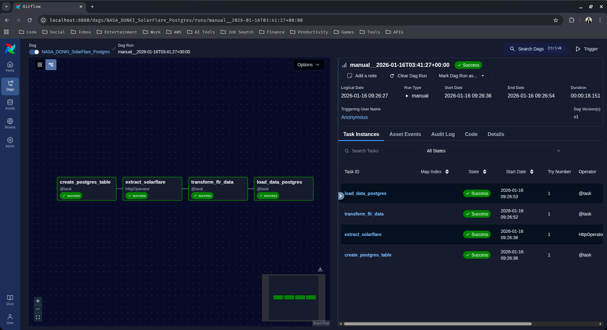
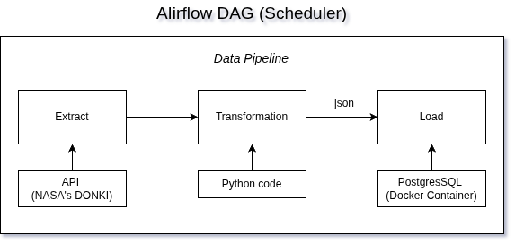

## Project Overview: 

> *Airflow ETL Pipeline with Postgres and NASA Solar Flare (DONKI) API Integration*

This project involves creating an ETL (Extract, Transform, Load) pipeline using Apache Airflow. The pipeline extracts data from an external API (in this case, NASA's **Solar Flare (DONKI) API**), transforms the data, and loads it into a Postgres database. The entire workflow is orchestrated by Airflow, which allows scheduling, monitoring, and managing workflows.

The project leverages Docker to run Airflow and Postgres as services, ensuring an isolated and reproducible environment. We also utilize Airflow hooks and operators to handle the ETL process efficiently.

---

### Key Components of the Project:

- **Airflow for Orchestration**:

Airflow is used to define, schedule, and monitor the ETL pipeline. It manages task dependencies, ensuring that the process runs sequentially and reliably.  The Airflow DAG (Directed Acyclic Graph) defines the workflow, including tasks like data extraction, transformation, and loading.

- **Postgres Database**:

PostgreSQL is used to store the extracted and transformed data.  
Postgres is hosted in a Docker container, making it easy to manage and ensuring data persistence through Docker volumes.  
We interact with Postgres using Airflow’s `PostgresHook` and tasks with the TaskFlow API.

- **NASA API (Solar Flare Data)**:

The external API used in this project is NASA’s **DONKI Solar Flare (FLR) API**, which provides information about solar flare events. The API returns JSON data including fields like flare ID, class type, begin/peak/end times, source location, active region number, and a reference link. We use Airflow’s `HttpOperator` to extract the data from the API.

---

### Objectives of the Project:

> **Extract Data**:

The pipeline extracts solar flare data from NASA’s DONKI API on a scheduled basis (daily).

> **Transform Data**:

Transformations such as selecting relevant fields and formatting timestamps are performed to ensure that the data is suitable for database storage.

> **Load Data**:

The transformed data is loaded into a Postgres database. Duplicate flare entries are prevented using a unique constraint on the `flr_id` field. The stored data can be used for further analysis, reporting, or visualization.

---

### Architecture and Workflow:

The ETL pipeline is orchestrated in Airflow using a DAG (Directed Acyclic Graph). The pipeline consists of the following stages:

1. **`Extract (E)`**:  
The `HttpOperator` is used to make HTTP GET requests to NASA’s Solar Flare (DONKI) API.  
The response is in JSON format, containing fields like flare ID, class type, begin/peak/end times, source location, active region number, and a reference link.

2. **`Transform (T)`**:  
The extracted JSON data is processed in the transform task using Airflow’s TaskFlow API (with the `@task` decorator).  
This stage involves extracting relevant fields and ensuring that timestamps are in the correct format for the database.

3. **`Load (L)`**:  
The transformed data is loaded into a Postgres table using `PostgresHook`.  
If the target table doesn’t exist, it is created automatically as part of the DAG using a create table task.  
The `ON CONFLICT` clause ensures that duplicate flare entries are skipped.

---

### Notes:

- The pipeline fetches **solar flare data for the last 30 days by default**, as per NASA DONKI API behavior.  
- The project runs entirely in **Dockerized Airflow and Postgres**, making it portable and reproducible.