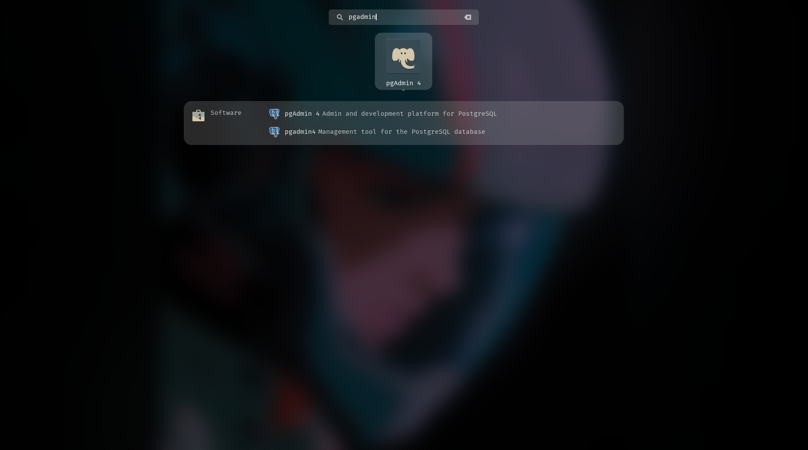
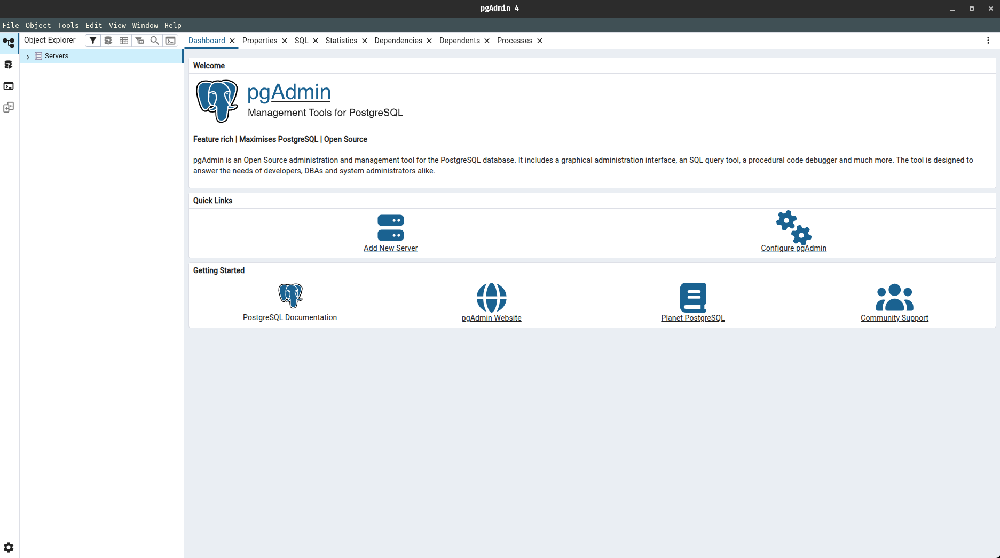
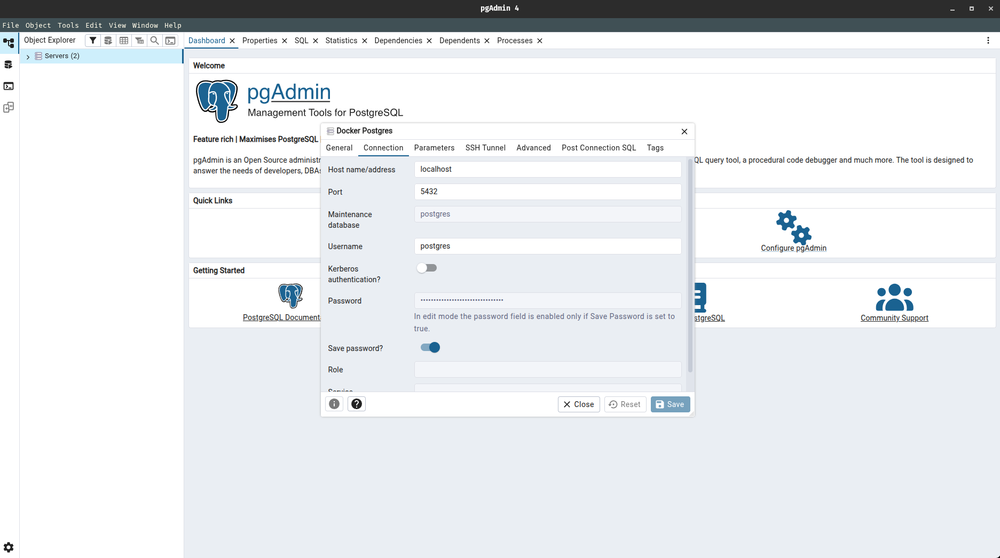
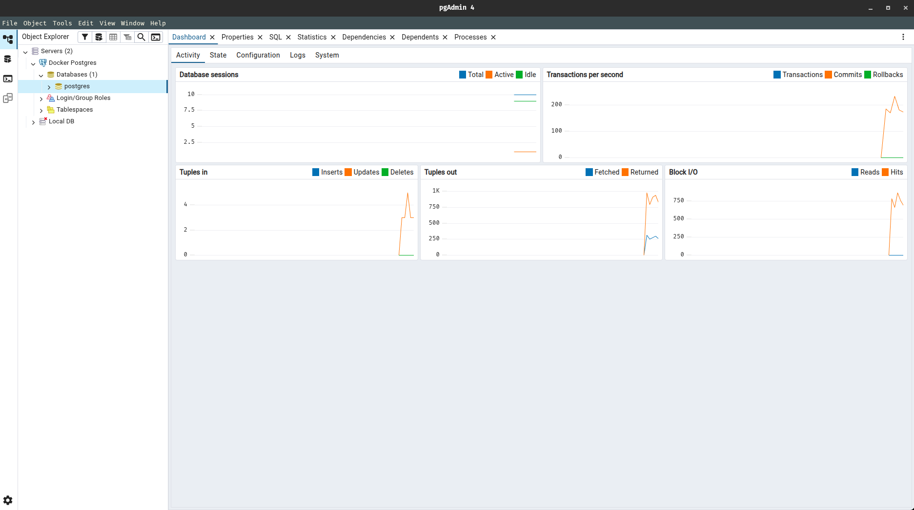
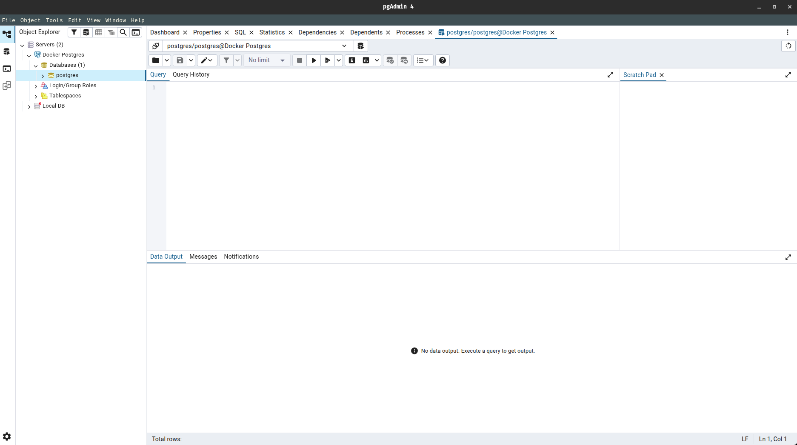
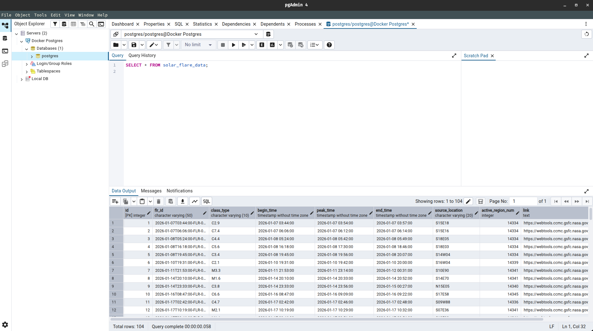

## ETL & Airflow Project

In this guide, we will build our first end-to-end ETL pipeline using Apache Airflow. We will utilize Astronomer to develop, deploy, and orchestrate our DAGs (Directed Acyclic Graphs), ensuring our data pipeline runs reliably on a defined schedule.

---

### 1. Initial Project Structure

> Before initializing our project structure, make sure you have astro cli installed in your machine 

```bash
siddhu@ubuntu:~$ astro version
Astro CLI Version: 1.38.1
```

> If you don't have it installed in your machine, then refer to the below links and follow their steps to install astro cli to your local machine

- [Setting Up Airflow With Astronomer (Astro)](https://github.com/SiddhuShkya/Machine-Learning-Operations/blob/main/docs/Apache-Airflow.md)

- [Astronomer Docs](https://www.astronomer.io/docs/astro/cli/overview)

After installing the astro cli, we can begin setting up our project structure. Follow the below steps

1.1 Create a new project folder (ETL-Starter-Project) and go inside it and from there open up your vs-code

```bash
siddhu@ubuntu:~/Desktop$ mkdir ETL-Starter-Project
mkdir: cannot create directory ‘ETL-Starter-Project’: File exists
siddhu@ubuntu:~/Desktop$ cd ETL-Starter-Project/
siddhu@ubuntu:~/Desktop/ETL-Starter-Project$ code .
```

1.2  Open your new terminal from the VS-Code and initialize your new project here, using the below command

```bash
siddhu@ubuntu:~/Desktop/ETL-Starter-Project$ astro dev init
/home/siddhu/Desktop/ETL-Starter-Project is not an empty directory. Are you sure you want to initialize a project here? (y/n) y
Initialized empty Astro project in /home/siddhu/Desktop/ETL-Starter-Project
```

1.3 Create a python virtual environment (venv) and activate it, to install our dependencies for reproducibility

```bash
siddhu@ubuntu:~/Desktop/ETL-Starter-Project$ python -m venv venv
siddhu@ubuntu:~/Desktop/ETL-Starter-Project$ source ./venv/bin/activate
(venv) siddhu@ubuntu:~/Desktop/ETL-Starter-Project$ 
```

1.4 Also since we are going to use PostgreSQL (an external service) for this project, let's also create another file which is docker-compose.yml

```bash
(venv) siddhu@ubuntu:~/Desktop/ETL-Starter-Project$ touch docker-compose.yml
```

After completing all the above steps, our project structure should look something like the below :

```text
.
├── airflow_settings.yaml
├── .astro
│   ├── config.yaml
│   ├── dag_integrity_exceptions.txt
│   └── test_dag_integrity_default.py
├── dags                                           # Your dags here
│   ├── .airflowignore
│   └── exampledag.py
├── Dockerfile
├── .dockerignore
├── .env
├── venv                                           # Your python virtual environment
├── .git                                         
├── .gitignore
├── include
├── packages.txt
├── docker-compose.yml                             # docker-compose.yml file here 
├── plugins
├── README.md
├── requirements.txt                               # Your dependencies here
└── tests
    └── dags
```

> Our project's initial setup is now complete. Lets jump into coding now

---

### 2. Defining ETL DAG With Implementing Steps

We will be working inside our dags folder to create our dag

2.1 Create a new python file (etl.py) inside the dags folder of our project

```bash
siddhu@ubuntu:~/Desktop/ETL-Starter-Project$ cd dags
siddhu@ubuntu:~/Desktop/ETL-Starter-Project/dags$ touch etl.py
```

> In thsi python file (etl.py) we be creating multiple tasks with respect to extract, transform and reload.

2.2 Copy paste the below code to the etl.py file

```python 
from airflow import DAG
from airflow.providers.http.operators.http import HttpOperator
from airflow.sdk import task
from airflow.providers.postgres.hooks.postgres import PostgresHook
import pendulum
from datetime import timedelta, date

## Define the DAG
with DAG(
    dag_id="NASA_DONKI_SolarFlare_Postgres",
    start_date=pendulum.datetime(2025, 1, 1, tz="UTC"),
    schedule="@daily",
    catchup=False,
) as dag:
    ## Step 1: Create the Postgres table if it doesn't exist
    @task
    def create_postgres_table():
        postgres_hook = PostgresHook(postgres_conn_id="my_postgres_connection")
        # Create a fresh table
        create_table_query = """
        CREATE TABLE IF NOT EXISTS solar_flare_data (
            id SERIAL PRIMARY KEY,
            flr_id VARCHAR(50) UNIQUE,
            class_type VARCHAR(10),
            begin_time TIMESTAMP,
            peak_time TIMESTAMP,
            end_time TIMESTAMP,
            source_location VARCHAR(20),
            active_region_num INT,
            link TEXT
        );
        """
        postgres_hook.run(create_table_query)

    ## Step 2: Extract DONKI Solar Flare data
    extract_solarflare_data = HttpOperator(
        task_id="extract_solarflare",
        http_conn_id="nasa_api",
        endpoint="DONKI/FLR?api_key={{ conn.nasa_api.extra_dejson.api_key }}",
        method="GET",
        response_filter=lambda response: response.json(),
        log_response=True,
        retries=3,
        retry_delay=timedelta(minutes=5),
    )

    ## Step 3: Transform the data (keep only important fields)
    @task
    def transform_flr_data(response):
        transformed = []
        for flare in response:
            transformed.append(
                {
                    "flr_id": flare.get("flrID"),
                    "class_type": flare.get("classType"),
                    "begin_time": flare.get("beginTime"),
                    "peak_time": flare.get("peakTime"),
                    "end_time": flare.get("endTime"),
                    "source_location": flare.get("sourceLocation"),
                    "active_region_num": flare.get("activeRegionNum"),
                    "link": flare.get("link"),
                }
            )
        return transformed

    ## Step 4: Load data into Postgres
    @task
    def load_data_postgres(flare_data):
        postgres_hook = PostgresHook(postgres_conn_id="my_postgres_connection")
        insert_query = """
        INSERT INTO solar_flare_data 
        (flr_id, class_type, begin_time, peak_time, end_time, source_location, active_region_num, link)
        VALUES (%s, %s, %s, %s, %s, %s, %s, %s)
        ON CONFLICT (flr_id) DO NOTHING;  -- prevent duplicates
        """
        for flare in flare_data:
            postgres_hook.run(
                insert_query,
                parameters=(
                    flare["flr_id"],
                    flare["class_type"],
                    flare["begin_time"],
                    flare["peak_time"],
                    flare["end_time"],
                    flare["source_location"],
                    flare["active_region_num"],
                    flare["link"],
                ),
            )

    ## Step 5: Define task dependencies
    # Extract
    create_postgres_table() >> extract_solarflare_data
    api_response = extract_solarflare_data.output
    # Transform
    transformed_data = transform_flr_data(api_response)
    # Load
    load_data_postgres(transformed_data)
```

> Tasks Explanation :

`Step 1` : The task is to create a PostgresSQL table which stores our final loaded data if it doesn't already exists. This is done using the  Postgreshook library which helps us interact with the PostgresSQL.

---

📌 *Important Note*

This PostgresSQL needs to be running somewhere, either i can run it in my local, or either i can run it in some cloud. For this project we are going to run our PostgresSQL as a docker container. We need to run it as a container because at the end of the day the astronomer is running our entire airflow project in another docker container. 

Therefore, since we have multiple containers running for the same project that also wants to interact with one another, we need to go ahead and define our docker-compose.yml file.

```yaml
version: "3.0"

services:
  postgres:
    image: postgres:13
    container_name: postgres_db
    environment:
      POSTGRES_USER: postgres
      POSTGRES_PASSWORD: postgres
      POSTGRES_DB: postgres
    ports:
      - "5432:5432"
    volumes:
      - postgres_data:/var/lib/postgresql/data
    networks:
      - airflow_network

volumes:
  postgres_data:

networks:
  airflow_network:
    external: false
```

--- 

`Step 2` : The task is to extract the NASA SOLAR FLARE (FLR) data using the HttpOperator. To do this we need to first set up our NASA API KEY using the below steps:

- Go to the nasa api website : [NASA API](https://api.nasa.gov/)
- Sign up and you should see that your API key has been mailed to your gmail account.
- Access/Test your API data using the below link with respect to your api key :

```text
https://api.nasa.gov/DONKI/FLR?api_key=YOUR_API_KEY_HERE
```

---

`Step 3` : The task is to transform the data. For this project we only specified the fields we want from the api in the form of key-value pairs.

--- 

`Step 4` : The task is to load the transformed SOLAR FLARE data into PostgreSQL by first creating a PostgresHook using the configured Airflow connection. It then defines an INSERT SQL statement and executes it with parameterized values taken from the transformed data dictionary, ensuring the selected fields are safely and correctly stored as a new record in the database.

---

`Step 5` : The task is to define the dependecies usig all the above tasks we created above, for the airflow ETL Pipeline. 

---

> In this project we are using only one data source (NASA SOLAR FLARE (FLR) DONKI API) for our ETL Pipeline. Usually, big data engineer teams working in a company, extracts data coming from multiple sources

2.3 Lets start and test run our pipline using airflow ui and see if there are any errors:

```bash
siddhu@ubuntu:~/Desktop/ETL-Starter-Project$ astro dev start
```

> If you see dag errors like this :


> Add the following library to your project's requirements.txt file and restart airflow project again

```python
## ETL-Starter-Project/requirements.txt

apache-airflow-providers-http
apache-airflow-providers-postgres
```

```bash
siddhu@ubuntu:~/Desktop/ETL-Starter-Project$ astro dev restart
```


> Your DAG has been created successfully without issues.

2.4 Let's setup our external connections now

> We are going to set up two external connections for this project : 

- API connection
- PostgresSQL connection

> In your airflow ui, go to settings and you should be able to see the option for connections


> Create and save connection for the NASA APOD API 


    

> Similarly create and save the connection for the PostgresSQL

For the host field, go to your docker desktop's container and from the running airflow container, click on the postgres container you should be able to see the host for the postgres


> For this project the host for Postgres is :

```text
etl-starter-project_30f1cc-postgres-1
```

As for your other fields :

- Login -> postgres
- Password -> postgres
- Database -> postgres
- Port -> 5432

> The same values we defined in our docker-compose.yaml


> After completing the connection setup let's trigger our dag.

2.5 Manually trigger/run your dag

> If you see all your tasks in green similar to he below one, then your dag has ran successfully without any issues.


> You can also see the output of each tasks, by selecting task and from there selecting XCom.

2.6 View your loaded data as a postgres table

> Since the postgres is running inside a container, you cannot diretcly open the url to see your postgres table. In order to connect to postgres container, we need to have a sql software like PgAdmin..

- Go to the link : [PgAdmin Setup Guide](https://github.com/SiddhuShkya/SQL-Bootcamp-Zero-To-Hero/blob/main/docs/Course%20materials/postgresql-and-pgadmin-setup.md)
- Download and set up your PgAdmin based on your system, if not already.

> After installing PgAdmin you should be able to see the PgAdmin icon from the apps menu



> Open the PgAdmin application, and from there click on 'Add New Server'



> After clicking next, setup your new server connection configuration

In our case:

- General tab: `Name` -> Docker Postgres
- Connection tab: `Host name/address` -> localhost
- Connection tab: `Port` -> 5432
- Connection tab: `Maintenance database` -> postgres
- Connection tab: `Username` -> postgres
- Connection tab: `Password` -> postgres

> Important, the configuration might change based on the set-up we had in our docker-compose.yml file



> Hit save, you should be able to connect to your new server. Now expand the server and you should be able to see the postgres database



> Right click on the postgres database and select 'Query Tool'. You should be able to see a query editor window.



> In the query editor window, type the following SQL query to view the data in the solar_flare_data table:

```sql
SELECT * FROM solar_flare_data;
```

> Select the query and press the play (Execute script) button.



2.7 The ETL pipeline has been completed and we have also verified that the data is being loaded into the postgres table using DBeaver. Now lets stop our project

```bash
siddhu@ubuntu:~/Desktop/ETL-Starter-Project$ astro dev stop
✔ Project stopped
```

---

# <div align="center">Thank You for Going Through This Guide! 🙏✨</div>

